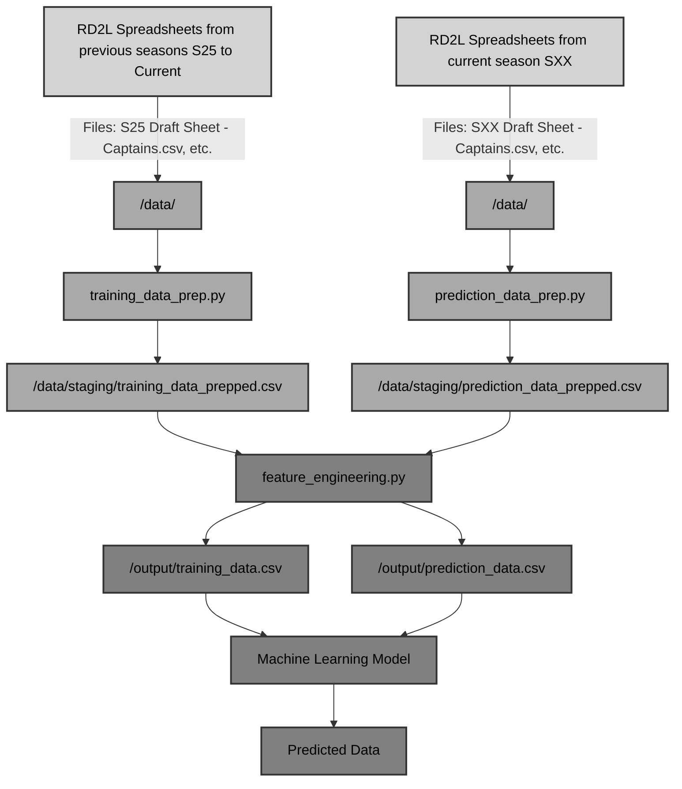

# RD2L Prediction Project
The goal of this project is to utilize data science techniques on information gathered on players in the league to predict different aspects within the league.  Initially this began with the goal of optimizing team composition but for the time being it has been scaled back for use as a predictive cost model.

## What is RD2L?
RD2L, initially standing for "Reddit Dota 2 League" (now R\* Dota 2 League as the Reddit association has dropped) is a self hosted amateur level competitive league.  Dota for the unfamiliar is a Moba (Multiplayer Online Battle Arena) game for the computer.  Players are grouped into teams of 5 where they then draft heroes to play in the individual match and then compete to destroy the other team's base. 

Within the RD2L league specifically, entrants are grouped into two categories, players and captains. Due to the amateur nature of the league and the goal to appeal to as many players as possible, there is a wide skill range of players who enter to compete.  This is where things tend to get very interesting.  Captains are given a currency that is based on their MMR or Matchmaking Rating within Dota.  This number has no ceiling but typically caps out around 7000 (for non-professional players).  The captains utilize this currency to bid on players in an event that is called the draft.  Players provide their MMR, comfort on playing each of the 5 roles within Dota (Carry, Mid, Offlane, Soft Support, and Hard Support) and most importantly, a link to their dotabuff account.  Dotabuff is one of the large services provided to the community that acts as a game database, carrying loads of statistics on individual players.  All of this is tied to their steam_id, an account specific number attached to their steam account (the service utilized to play Dota 2).  These outside services are the primary way that we will be gathering information.  

## Outside Services and Data Collection
Currently there are 4 ways to gather information that we would be able to use when training a model.  
### Spreadsheet: 
The information provided by the google sheets spreadsheet that the organization runs is unfortunately bare minimum at best.  Ultimately we will utilize previous season spreadsheets as the baseline information giving us the following: MMR, Player_id, Role comfort and cost.  Player_id is originally given as a dotabuff url but with some quick python string parsing we can extract the information.  "https://www.dotabuff.com/players/{player_id}" can be modified with a simple function mapped onto a Pandas DataFrame:
```
def modification(input_string):
	return input_string.split("/")[-1]
```
Then applying the following:
```
DataFrame['Dotabuff'] = DataFrame['Dotabuff'].map(modification)
```
### Dotabuff:
This is a great tool for general users but for applications it is quite poor.  We will be exploring it much later as an extension tool, but because it lacks an API we will need to utilize web scraping techniques. 

### OpenDota:
This is the API that I used primarily in the beginning. This was used to capture individual hero information for each individual player.  This generates a json input with hero_id, last_played , games, wins, with_games, with_wins, against_games, and against_win.  For the original program, we only utilized the hero_id, games (Per specific hero_id) and win (again per specific hero_id).  This allows us to create a bunch of DataFrame columns with "{"hero_id"}\_games" and "{"hero_id"}\_winrate".  This is simply the sum of all games and the sum of all wins divided by the sum of all games respectively.  

### Stratz:
This is something that at the time of program creation I hadn't even thought to utilize.  After briefly looking into it after learning that the website has an API, I believe this is a very good utility that has potential to grab league data.  More on this later. 

## What are the Important Variables?
The first rendition of this program struggled with time constraints on the project which limited the amount of variables that we could engineer (Feature Engineering).  We will seperate this next section into data that was readily available from our spreadsheets and features that we worked on engineering.  

### Spreadsheet Data
* Player's ID
* Player's MMR
* Monetary Information (Per Season)
* Cost (If applicable as this is the variable that we are trying to find)
* Position Comfort

#### *Quick Discussion on Position Comfort*
Position comfort is a self identified statistic on players essentially putting them in charge of determining their own role.  This inherently leads to several issues, primarily with the accuracy of the self recorded stats.  Due to the casual nature of the league, two issues stand out:
1. A player purposefully self reports incorrectly.  This actually happens quite frequently as the website labels this as a 'role confidence'.  This can range from a self report of something like [1, 1, 1, 2, 3], signifying that the player is only partially confident in pos4 and at average capabilities on pos 5.  It can also reach extremes of players purposefully putting false information to be funny, [1, 1, 1, 1, 1] is another typical example.
2. A player might want to play a different position in the league than they do in a typical Dota environment.  This truthfully should be fairly easy to filter.  

#### *Quick Filtering Idea*
Train a Machine Learning model to distinguish the players position based on several different values.  Look into Model Persistence on scikit for info on saving a trained model for further identification.  After running the model on the player we could run a simple analysis on the inputs that the player gave.  If the two are very far off, the player could be flagged to notify whoever is running the program to ask the player for role verification.  Results of [5, 5, 5, 5, 5] and [1, 1, 1, 1, 1] can be ignored.  

### Feature Engineering
* Hero Data: Utilizing the Opendota API, we can call what is in essence the heroes page from a user.  We receive a json format esque string which we transform as shown below:
```
{
	"hero_id": 0,
	"last_played": 0,
	"games": 0, 
	"win": 0,
	"with_games": 0,
	"with_win": 0,
	"against_games": 0,
	"against_win": 0
}
```
Will be converted to something along the lines of:
```
+--------------------+--------------------+--------+---------------------+-------------------+
|   {hero_id}_games  | {hero_id}_winrate  |  ...   | total_games_played  |  total_winrate    |
+--------------------+--------------------+--------+---------------------+-------------------+
|          0         |         0%         |        |          0          |         0%        |
+--------------------+--------------------+--------+---------------------+-------------------+
```

* We can additionally calculate the last two columns here with some simple analysis of the hero data.  total_games_played is simply the sum of all games for each individual hero.  total_winrate is simply the sum of all wins divided by the sum of all games.  

## Program Structure


## Results
After performing analysis and training a model by using Random Forest Regression, our model scored a 0.81769 which is evaluated through the residual sum of squared through scikit-learn.  The best possible score is a 1.0 while a score of 0 would be the result of the model not giving any association when producing results.  Currently RD2L performs a simple proportional distribution based on the amount of currency in the league and the MMR of players. 

The model that was trained on previous season data predicted the costs with lower accuracy then the costs that was predicted through the spreadsheets proportional distribution.  I analyzed the results using several different comparison formulas.
```
+--------------------------+------------------+------------------------------+
|                          | Machine Learning | Proportional Distribution    |
+--------------------------+------------------+------------------------------+
| Mean Absolute Error      |            34.33 |                       29.23  |
+--------------------------+------------------+------------------------------+
| Mean Squared Error       |          2428.91 |                     1395.16  |
+--------------------------+------------------+------------------------------+
| Root Mean Squared Error  |            49.28 |                       37.35  |
+--------------------------+------------------+------------------------------+
| R-Squared                |             0.63 |                        0.79  |
+--------------------------+------------------+------------------------------+
```

#### *Quick Discussion on Possible Bias* 
An interesting thought here, the information on the spreadsheet was available to all captains prior to the draft occurring.  It is possible that given this information a bias was created which inevitably skews the data towards the Proportional Distribution results.  Inevitably though, our training data contains the same information so there shouldn't be too much of a bias actually presenting itself and if it was present, our data that we trained the model on would have accounted for that. 

As our prediction program continues to improve, we can utilize these comparison evaluations to determine if the changes that we are making are beneficial to the performance of the model.  This of course as well as the individual model's .score() functionality.  
